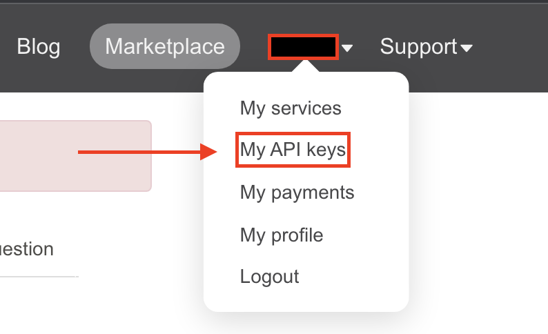

# Raspberry Pi Magic Mirror

raspberry pi 를 이용한 스마트 미러 프로젝트 가이드 입니다.

라즈베리 파이에서 직접 작업하는 전제로 작성되었습니다.

목차

## raspberry pi 설정

### os image 굽기

미리 다운로드 하지 않고 진행하면 시간이 너무 오래 소요되어 img 파일을 미리 다운로드 받아서 진행 하겠습니다.

1. os image 다운로드 후 압축 해제 [링크](https://www.raspberrypi.com/software/operating-systems/)


2. 접속 운영 체제에 맞는 Imager 설치 후 실행 [링크](https://www.raspberrypi.com/software/)


3. 다운로드 받은 img 파일 선택


4. 디스크 선택


> alt (맥 cmd) + shift + x 키 입력시 미리 와이파이와 ssh 를 설정할수 있습니다.


5.이미지 굽기


### raspberry pi 초기 설정

부팅 후 configuration 창이 뜨면 설정을 완료한다.

- [vnc](https://ko.wikipedia.org/wiki/VNC) 또는 [ssh](https://ko.wikipedia.org/wiki/%EC%8B%9C%ED%81%90%EC%96%B4_%EC%85%B8) 를 사용해 작업시 설정


### 비밀번호 변경방법

사용자 암호 변경

```sh
sudo passwd pi
```

루트 사용자 암호 변경

```sh
sudo passwd root
```

### ssh 접속 방법

- 터미널 열기


라즈베리 파이 로컬 ip 주소

```sh
hostname -I
```

원격 컴퓨터에서 접속

윈도우 cmd, 맥 terminal

```sh
ssh pi@라즈베리파이 ip 주소
```

초기 비밀번호 `raspberry`

### vnc 접속 방법

라즈베리 파이 터미널 열기

vnc sever 실행

```sh
vncserver
```

vncserver 를 계속 사용할 때 시작프로그램으로 등록하기.

```sh
echo "vncserver" >> ~/.bashrc
```

라즈베리 파이 로컬 ip 주소

```sh
hostname -I
```

vnc viewer 프로그램은 real vnc 프로그램을 사용해 진행하겠습니다.

[real vnc](https://www.realvnc.com/en/connect/download/viewer/)

링크에서 운영 체제에 맞는 프로그램 다운로드 후 실행.

- 우클릭 후 새로운 세션 생성


- 라즈베리 파이 로컬 ip 주소 입력


- username, password 입력

초기 설정

username : pi

password : raspberry


### 라즈베리 파이 설정

라즈베리파이 업데이트, 한글 폰트 설치

```sh
sudo apt-get update && sudo apt-get -y dist-upgrade && sudo apt-get -y install fonts-nanum fonts-symbola
```

디스플레이 설정

```sh
printf "config_hdmi_boost=7\nhdmi_group=2" | sudo tee -a /boot/config.txt && sudo reboot
```

## Magic Mirror 설정

smart-mirror repository 클론

```sh
git clone https://github.com/2012monk/smart-mirror.git
```

### npm 설치

```sh
curl -sL https://deb.nodesource.com/setup_17.x | sudo -E bash - && sudo apt install -y nodejs
```

### npm 버전 관리

[참고](https://velog.io/@zlemzlem5656/node-version-%EB%B3%80%EA%B2%BD%ED%95%98%EA%B8%B0)

```sh
sudo npm install -g n && sudo n 14.18.2
```

버전확인 npm 6.14.15 npm 14.18.2 확인

```sh
node -v && npm -v 
```

### Magic Mirror 설치

```sh
cd ~ && git clone https://github.com/MichMich/MagicMirror
```

```sh
npm install --prefix ~/MagicMirror
```

설정파일 붙여넣기

```sh
cp ~/smart-mirror/config.js ~/MagicMirror/config/config.js
```

실행

```sh
cd ~/MagicMirror && npm run start
```

종료

```
컨트롤 + q
```

## Magic Mirror Module 설치

구글 어시스턴트 모듈
Microsoft TODO 모듈
날씨 모듈

설치 할 모듈 github 링크

- [MMM-GoogleAssistant](https://github.com/bugsounet/MMM-GoogleAssistant)
- [MMM-Detector](https://github.com/bugsounet/MMM-Detector)
- [MMM-MicrosoftToDo](https://github.com/thobach/MMM-MicrosoftToDo)
- [MMM-OpenWeatherForecast](https://github.com/jclarke0000/MMM-OpenWeatherForecast)

## Google Assistant 연동

[참고 youtube](https://www.youtube.com/watch?v=xVhqP3fBnVM&ab_channel=PeanutmooseH)

호환성

tested version
node  14.18.2
npm 6.14.15

위 버전보다 최신 버전에서는 호환성 이슈가 있습니다.

### MMM-Detector

[MMM-Detector github](https://github.com/bugsounet/MMM-Detector)

현재 config 파일의 설정으로 ok google, hey google, jarvis 세가지 핫 워드가 활성화 되어있습니다.

원어에 가까운 발음일수록 인식이 잘 됩니다.

```sh
cd ~/MagicMirror/modules && git clone https://github.com/bugsounet/MMM-Detector.git
```

```sh
npm install --prefix ~/MagicMirror/modules/MMM-Detector
```

### MMM-GoogleAssistant 모듈 설치

Module 설치

```sh
cd ~/MagicMirror/modules && git clone https://github.com/bugsounet/MMM-GoogleAssistant.git 
```

```sh
npm install --prefix ~/MagicMirror/modules/MMM-GoogleAssistant
```

- 아래와 같은 문가가 나올경우 y 입력 의존성 패키지 설치


- 아래와 같은 __오류__ 발생시 light 버전으로 설치해야 하기 때문에 `npm install` 한번 더 입력


```sh
npm install
```

Google Assistant Setup

[module guide](https://wiki.bugsounet.fr/en/MMM-GoogleAssistant/GoogleAssistantSetup)

1. [액션 콘솔](https://console.actions.google.com/u/0/) 에서 새로운 프로젝트 생성


- 동의


- 생성


- 하단으로 스크롤 후 device registration 클릭


- 프로젝트 페이지 에서 register model


- 원하는 이름입력, device type tv


- client secret 다운로드 후 계속 진행


2.[google cloud platform](https://console.cloud.google.com/) 접속

- 동의


- 위에서 생성 했던 프로젝트 선택


- 메뉴 - api 및 서비스 - 라이브러리 선택


- google assistant api 검색 후 선택


- api 사용 시키기


- OAuth 동의 화면 구성


- 앱 게시


- 프로젝트 생성시 client secret 을 다운받지 않았다면 사용자 인증 정보에서 찾을수 있다


- __다운 받은 client secret 을 credentials.json 으로 이름변경 후 모듈 디렉터리로 이동__

라즈베리 파이 에서 진행시

```sh
mv 파일경로 ~/MagicMirror/modules/MMM-GoogleAssistant/credentials.json
```

라즈베리 파이가 아닌 원격 컴퓨터에 client secret 을 다운로드 받았을때 옮기기

윈도우 cmd, 맥 terminal 에서 진행

```sh
scp 파일경로 pi@라즈베리파이ip:/home/pi/MagicMirror/modules/MMM-GoogleAssistant/credentials.json
```

- 토큰 인증

```sh
cd ~/MagicMirror/modules/MMM-GoogleAssistant && npm run tokens
```

y 입력


- google 로그인 후 코드 복사해서 콘솔에 붙여넣기

__브라우저가 열리지 않는다면 링크를 복사해서 직접 접속한다.__


- 코드 복사


- 콘솔에 붙여넣기


### MMM-OpenWeatherForecast

[github](https://github.com/jclarke0000/MMM-OpenWeatherForecast)

```sh
cd ~/MagicMirror/modules && git clone https://github.com/jclarke0000/MMM-OpenWeatherForecast.git
```

```sh
npm install --prefix ~/MagicMirror/modules/MMM-OpenWeatherForecast
```

api key 발급 및 설정 하기

- [회원가입](https://home.openweathermap.org/users/sign_up)


- [api key 발급](https://openweathermap.org/api)


- [api key 확인](https://home.openweathermap.org/api_keys)




- config.js 수정


발급 받은 api key 입력

현재 위치의 위도, 경도 입력


[현재위치 위도 경도 찾기](https://support.google.com/maps/answer/18539?hl=ko&co=GENIE.Platform%3DDesktop)


## 마이크로 소프트 todo 앱과 연동 MMM-MicrosoftTodo

[원본 설치 가이드](https://github.com/thobach/MMM-MicrosoftToDo)

```sh
cd ~/MagicMirror/modules && git clone https://github.com/thobach/MMM-MicrosoftToDo.git
```


```sh
npm install request --save && npm install --prefix ~/MagicMirror/modules/MMM-MicrosoftToDo
```

1. [링크](https://portal.azure.com/#blade/Microsoft_AAD_IAM/ActiveDirectoryMenuBlade/RegisteredApps) 으로 접속후 로그인 (회원가입 필요) 후 새 프로젝트 생성.


2. 프로젝트 이름 입력

   지원되는 계정 유형 선택 (모든 조직 디렉터리의 계정)

   리디렉션 uri 웹 선택 후 주소에 <http://localhost:8080/tokens> 입력


3. 클라이언트 비밀 발급


4. 클라이언트(애플리케이션) 아이디와 클라이언트 비밀 을 복사해둔다

클라이언트 아이디


클라이언트 비밀


5. 서버 실행 명령어 입력

```sh
cd ~/smart-mirror && node app.js
```

6. [링크](http://localhost:8080) 으로 접속

    위에서 복사해둔 client id 와 client secret 입력 후 submit 클릭


## 시작시 자동실행

```sh
cd ~ && echo "cd ./MagicMirror && npm start" > mm.sh && sudo npm install -g pm2 && pm2 startup
```

```sh
sudo env PATH=$PATH:/usr/local/bin /usr/local/lib/node_modules/pm2/bin/pm2 startup systemd -u pi --hp /home/pi && pm2 start mm.sh && pm2 save
```
